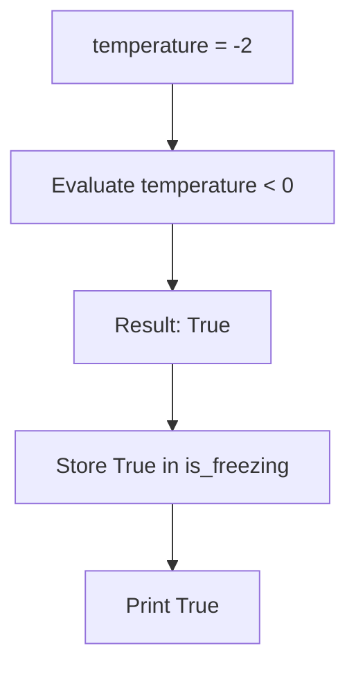
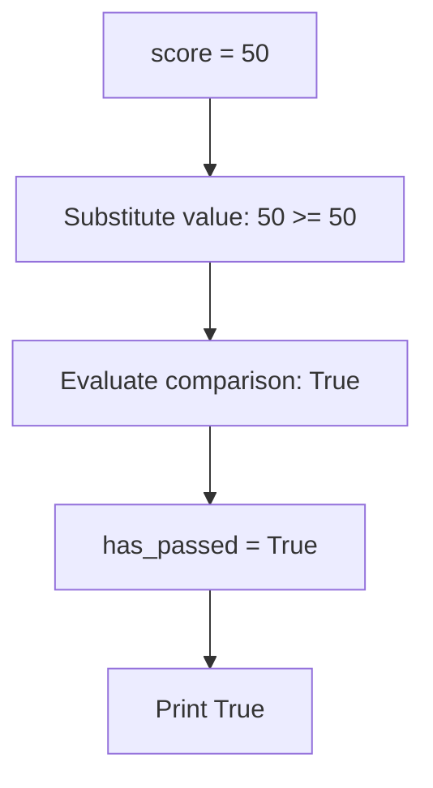
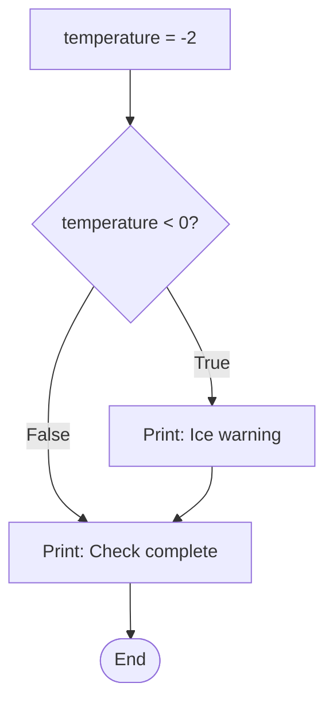
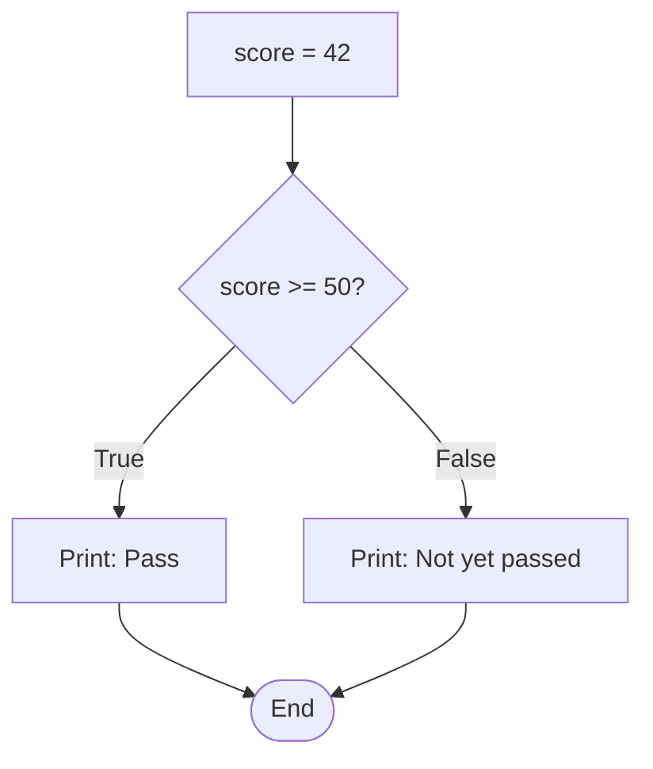
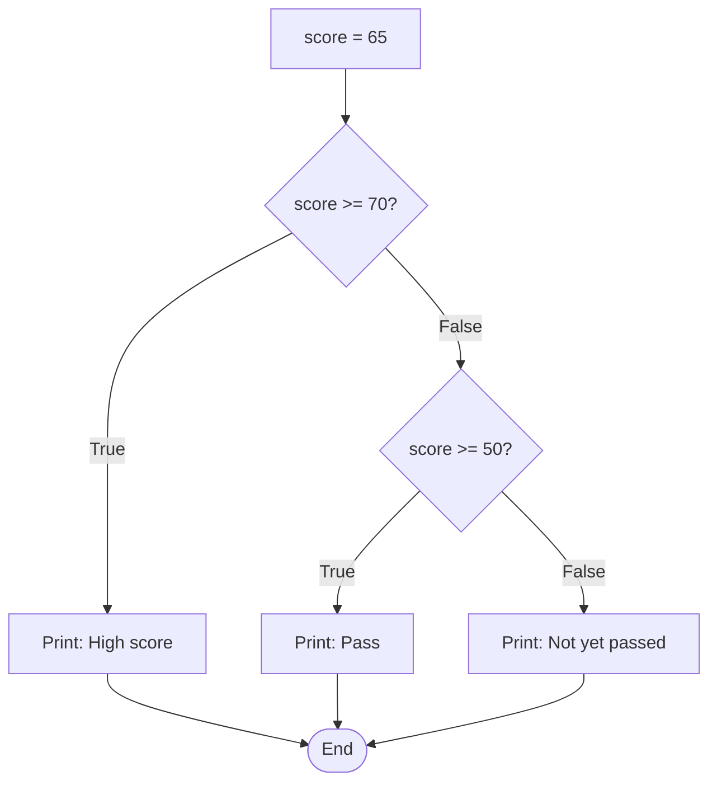
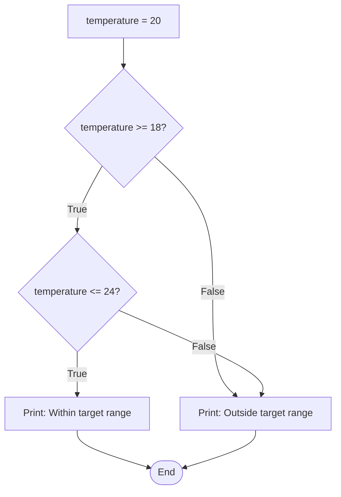
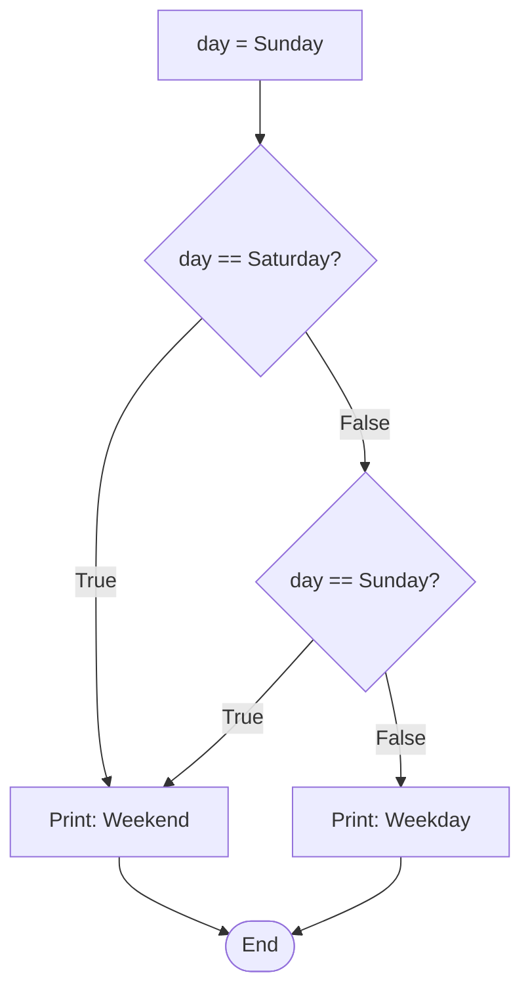
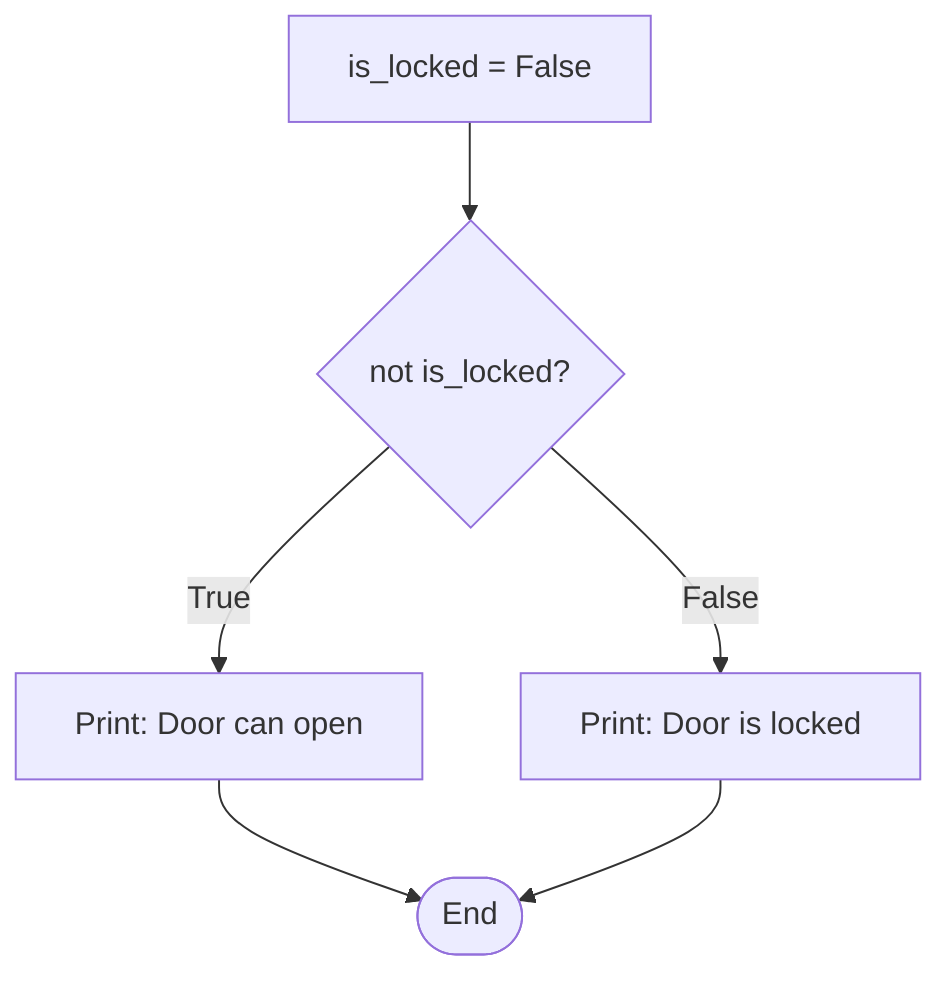
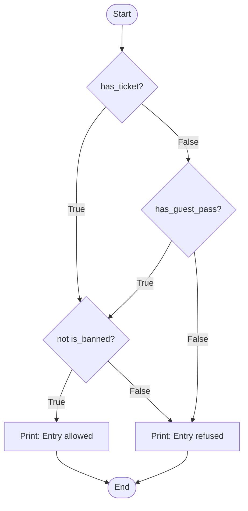

# Boolean logic and selection in Python

**Handout — SCQF level 7**  
**Progression:** Boolean values → comparisons → simple selection → alternative branches → compound conditions.

## Learning intentions

By the end of this handout, you should be able to:

- Explain how Boolean values represent the result of a condition.
- Trace how relational and logical operators evaluate expressions.
- Explain how Python uses those results to choose a branch.
- Read and explain selection using `if`, `elif` and `else`, including compound conditions.

## 1. Boolean logic: representing a decision

Programs often need to make decisions: display a warning, check whether a score reaches a target, or decide whether someone may enter. Boolean logic gives us a way to describe the conditions behind these decisions precisely.

Boolean logic works with two values: **true** and **false**. In Python, these are written `True` and `False`, with capital letters and without quotation marks. They belong to the data type `bool`. A Boolean value records whether something is true; it does not describe how strongly it is true.

Quotation marks change the meaning: `True` is a Boolean value, whereas `"True"` is a string containing four characters of text.

A **condition** is an expression used to make a decision. An **expression** is a piece of code that Python can work out to produce a value. To **evaluate** an expression means to work out that value.

Start with a question that has a yes/no answer: “Is the temperature below zero?” Python can answer this by comparing the temperature with zero. The result of the comparison is a Boolean value.

```python
temperature = -2
is_freezing = temperature < 0
print(is_freezing)  # True
```

The first line stores `-2` in a variable called `temperature`. A variable is a name that refers to a value. On the second line, Python evaluates `temperature < 0`: because −2 is below zero, the result is `True`. It then stores that result in `is_freezing`. The `=` symbol assigns a value to a variable.

Finally, `print(is_freezing)` displays the result. The text after `#` is a comment for the reader; Python does not run it as code.



**Key distinction:** evaluating a condition produces a result. Choosing what to do with that result is a separate step.

## 2. Relational operators: producing Boolean results

Relational operators, also called **comparison operators**, compare two values. An operator is a symbol or keyword that tells Python what operation to perform. In `temperature < 0`, the `<` operator asks whether the value on its left is less than the value on its right.

With the numbers used here, each comparison evaluates to either `True` or `False`. The comparison itself does not change either value.

| Operator | Meaning | Example | Result |
| --- | --- | --- | --- |
| `==` | Equal to | `5 == 5` | `True` |
| `!=` | Not equal to | `5 != 5` | `False` |
| `<` | Less than | `3 < 5` | `True` |
| `<=` | Less than or equal to | `5 <= 5` | `True` |
| `>` | Greater than | `3 > 5` | `False` |
| `>=` | Greater than or equal to | `5 >= 5` | `True` |

### Trace a simple comparison

```python
score = 50
has_passed = score >= 50
print(has_passed)  # True
```

Python retrieves the value of `score`, compares it with `50`, and produces `True`. The equality part of `>=` matters: a score of exactly 50 meets the condition.



**Checking the boundary:** the boundary is the value at which the outcome changes. Here, that value is 50. `score > 50` asks whether the score is above 50, so it produces `False` when the score is exactly 50. `score >= 50` asks whether the score is 50 or above, so it produces `True`. Choosing the correct operator depends on whether the rule includes the boundary value.

**Assignment versus comparison:** `score = 50` stores a value; `score == 50` checks whether the stored value equals 50.

For these examples, scores are stored as numbers. `50` is a number, but `"50"` is text. Comparing a string with a number using `>=` raises a `TypeError`; Python needs suitable types of values for the comparison.

## 3. A simple `if`: act when a condition is true

Python normally runs statements from top to bottom. **Selection** lets a program choose which statements to run, based on a condition. Each possible route through the decision is called a **branch**.

An `if` statement connects the condition to an action. Python first evaluates the condition after `if`. If it is true, Python runs the indented block: the statements set in from the left margin. If it is false, Python skips that block and continues after it.

```python
temperature = -2

if temperature < 0:
    print("Ice warning")

print("Check complete")
```



The comparison `-2 < 0` produces `True`, so Python prints `Ice warning`. It then reaches the statement after the indented block and prints `Check complete`.

If the temperature were 4, the comparison would produce `False`. Python would skip the warning and still print `Check complete`. That final statement is outside the `if` block, so it does not depend on the condition.

Read the flowchart by following the arrows from top to bottom. A **diamond** represents a decision; follow the arrow labelled with the condition's result. Rectangles represent actions, and rounded shapes mark the start or end. When the branches rejoin, execution continues along the shared path.

### Syntax to notice

- A colon (`:`) ends the `if` header and introduces its block.
- Indentation identifies the statements that belong to the block; use four spaces consistently. A block may contain several statements at the same indentation level.
- Returning to the previous indentation level ends the block. Indentation affects what the program does; it is part of Python's syntax, not just presentation.

Python can also test other values for “truthiness”, but this handout uses Boolean variables and expressions with Boolean results.

## 4. `if` / `else`: choose between two alternatives

Use `else` when there is an action for the false outcome as well. Read the structure as “if this condition is true, do this; otherwise, do that”. Exactly one of these two branches runs each time Python reaches the decision.

```python
score = 42

if score >= 50:
    print("Pass")
else:
    print("Not yet passed")
```



`42 >= 50` evaluates to `False`, so Python skips `print("Pass")` and runs the `else` block, displaying `Not yet passed`. For a score of 50 or more, it would run the first block and skip the second.

`else` has no condition of its own: it handles the false outcome of the preceding test. It still needs a colon and an indented block. Align `else` with its matching `if` so the two alternatives are clear.

## 5. `if` / `elif` / `else`: test alternatives in order

Some decisions have more than two possible outcomes. `elif`, short for “else if”, adds another condition to check when the previous condition was false.

Python checks the conditions from top to bottom until one is true. It runs that branch, then skips the remaining `elif` and `else` branches in the chain. If all conditions are false, the optional `else` block runs. Without an `else`, Python simply continues after the chain when no condition is true.

The following thresholds are illustrative, not an assessment grading policy.

```python
score = 65

if score >= 70:
    print("High score")
elif score >= 50:
    print("Pass")
else:
    print("Not yet passed")
```



**Tracing the example** means following what Python does with the given values. First, `65 >= 70` is false, so Python moves to the `elif`. Next, `65 >= 50` is true, so it prints `Pass`. It then skips the `else` block.

The middle branch therefore covers scores from 50 up to, but not including, 70. Although its condition only says `score >= 50`, reaching that condition already tells us that the score is below 70: the earlier test failed.

**Order matters:** a score of 75 satisfies both comparisons, but only the first branch runs. Putting `score >= 50` first would prevent the later high-score branch from ever being selected.

Separate `if` statements behave differently: each is tested independently, so more than one block can run.

## 6. Logical operators: combine simple conditions

So far, each decision has tested one comparison at a time. A **compound condition** combines conditions into one expression. This is useful when a rule depends on more than one requirement, such as a temperature being above a minimum and below a maximum.

Logical operators work with the results of those conditions. Relational operators compare values; logical operators combine or reverse the answers. Python uses the final result to select a branch in exactly the same way as before.

The following **truth table** lists every possible pair of Boolean values and shows the result of combining them. `A` and `B` stand for conditions; each could be a comparison such as `score >= 50`. The values an operator works on are called its **operands**.

| A | B | `A and B` | `A or B` |
| --- | --- | --- | --- |
| `False` | `False` | `False` | `False` |
| `False` | `True` | `False` | `True` |
| `True` | `False` | `False` | `True` |
| `True` | `True` | `True` | `True` |

- **`and`:** both conditions must be true.
- **`or`:** at least one condition must be true, including when both are true.
- **`not`:** reverses a Boolean value: `not True` is `False`, and `not False` is `True`.

### 6.1 `and`: require both conditions

```python
temperature = 20

if temperature >= 18 and temperature <= 24:
    print("Within target range")
else:
    print("Outside target range")
```

Read this condition as “the temperature is at least 18 and at most 24”. For 20, `temperature >= 18` is `True` and `temperature <= 24` is also `True`. Combining them gives `True and True`, which is `True`, so Python prints `Within target range`.

A temperature of 25 passes the first comparison but fails the second. One true result is not enough for `and`, so it takes the outside-range branch. The endpoints 18 and 24 are included because both comparisons allow equality.



Python also permits the equivalent chained comparison `18 <= temperature <= 24`.

### 6.2 `or`: accept either condition

```python
day = "Sunday"

if day == "Saturday" or day == "Sunday":
    print("Weekend")
else:
    print("Weekday")
```



For `"Sunday"`, the first comparison is false and the second is true. `False or True` gives `True`, so Python prints `Weekend`. Only one matching comparison is needed. For `"Monday"`, both would be false and Python would print `Weekday`.

In Boolean logic, `or` also allows both conditions to be true. The day cannot match both names in this example, but other rules can meet both alternatives.

This example assumes `day` contains a correctly capitalised day name. String equality is case-sensitive: `"Sunday"` and `"sunday"` are different values.

Write each comparison in full. `day == "Saturday" or "Sunday"` does not compare `day` with both strings: the non-empty string `"Sunday"` is truthy, so that condition always selects the true branch.

### 6.3 `not`: reverse a condition

```python
is_locked = False

if not is_locked:
    print("Door can open")
else:
    print("Door is locked")
```



Read `not is_locked` as “the door is not locked”. Because `is_locked` holds `False`, `not is_locked` evaluates to `True`, so Python prints `Door can open`. If `is_locked` held `True`, the result would be `False` and the other branch would run.

`not` reverses the value for this expression; it does not change the value stored in `is_locked`. A Boolean variable can also be tested directly with `if is_locked:`; it does not need `== True`.

### Short-circuit evaluation

Python evaluates these combined conditions from left to right and stops as soon as the result is known. This is called **short-circuit evaluation**. The split decisions in the `and` and `or` flowcharts show where this happens:

- With `and`, a false first condition determines the result, so Python skips the second condition.
- With `or`, a true first condition determines the result, so Python skips the second condition.

For example, if the temperature is 10, the first test in the range check is false. Python does not need to check whether it is at most 24: the temperature has already failed one of the two requirements.

**Further detail:** these examples combine Boolean expressions, so their combined results are Boolean values. More generally, Python's `and` and `or` return one of the values they operate on, which need not be a Boolean. `not` always returns a Boolean. The official reference below explains this wider behaviour.

## 7. Combine operators to express a fuller rule

**Rule:** a person may enter if they have a ticket or a guest pass, provided they are not banned.

```python
has_ticket = False
has_guest_pass = True
is_banned = False

if (has_ticket or has_guest_pass) and not is_banned:
    print("Entry allowed")
else:
    print("Entry refused")
```

Build the evaluation in stages:

1. `(has_ticket or has_guest_pass)` → `False or True` → `True`.
2. `not is_banned` → `not False` → `True`.
3. `True and True` → `True`, so the entry-allowed branch runs.



When an expression contains several operators, Python uses **operator precedence** to decide how its parts are grouped. For the operators covered here, comparisons have higher precedence than `not`, followed by `and`, then `or`. This determines the meaning of the expression; short-circuit rules still determine whether each part needs to be evaluated.

Parentheses explicitly group parts of a condition. Here, `(has_ticket or has_guest_pass)` is one requirement: the person has an accepted way to enter. `not is_banned` is the other requirement. The `and` means both requirements must be met.

Without the parentheses, `has_ticket or has_guest_pass and not is_banned` would allow anyone with a ticket to enter, even if banned, because `and` groups more tightly than `or`.

As conditions become longer, meaningful variable names can make them easier to read and explain. The following version stores the two stages of the rule before using the final Boolean value in an `if`. It makes the same entry decision as the previous example:

```python
has_entry_permission = has_ticket or has_guest_pass
can_enter = has_entry_permission and not is_banned

if can_enter:
    print("Entry allowed")
else:
    print("Entry refused")
```

## 8. Closing reference: from values to program flow

| Stage | Purpose | Example |
| --- | --- | --- |
| Values | Supply the data | `score = 65` |
| Relational expression | Compare values | `score >= 50` → `True` |
| Logical expression | Combine Boolean conditions | `score >= 50 and work_submitted` |
| Selection | Choose which code runs | `if`, `elif`, `else` |

When reading selection code, identify the values, evaluate the conditions in order, and follow the selected branch. Check boundary values, grouping and indentation to explain why that branch runs.

## Sources and further reading

The official Python documentation provides the language definitions behind the explanations. W3Schools provides additional introductory explanations and examples for the same topics.

| Topic in this handout | Official Python documentation | W3Schools |
| --- | --- | --- |
| Boolean values and conditions | [Truth value testing](https://docs.python.org/3/library/stdtypes.html#truth-value-testing) | [Python Booleans](https://www.w3schools.com/python/python_booleans.asp) |
| Relational operators and boundaries | [Comparisons](https://docs.python.org/3/library/stdtypes.html#comparisons) | [Python Operators](https://www.w3schools.com/python/python_operators.asp) |
| Choosing branches | [`if` statements](https://docs.python.org/3/tutorial/controlflow.html#if-statements) | [Python If Statement](https://www.w3schools.com/python/python_conditions.asp) |
| `and`, `or`, `not` and short-circuit evaluation | [Boolean operations](https://docs.python.org/3/library/stdtypes.html#boolean-operations-and-or-not) | [Python Operators](https://www.w3schools.com/python/python_operators.asp) |
| Grouping mixed operators | [Operator precedence](https://docs.python.org/3/reference/expressions.html#operator-precedence) | [Python Operators](https://www.w3schools.com/python/python_operators.asp) |

*Flowcharts use Mermaid code blocks and render in Markdown viewers with Mermaid support.*
