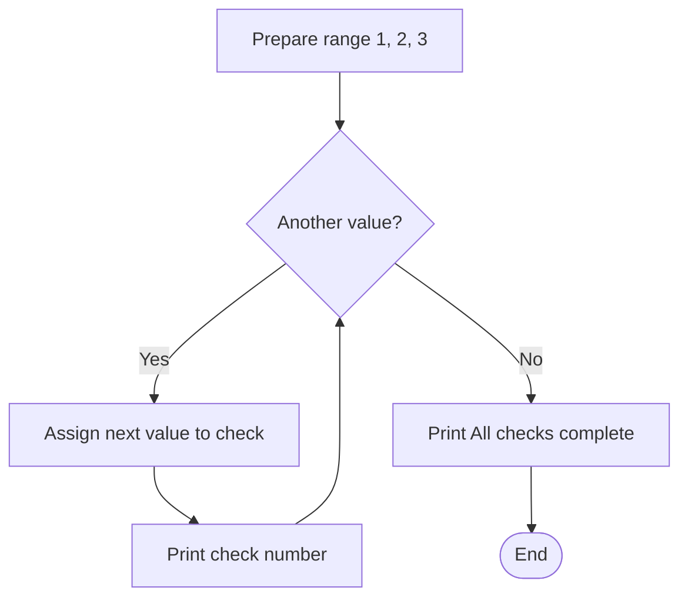
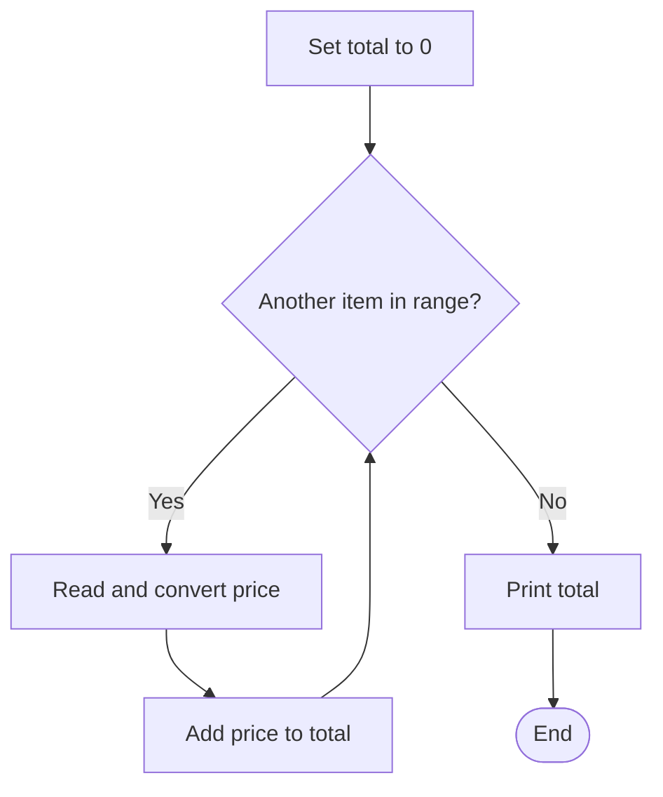
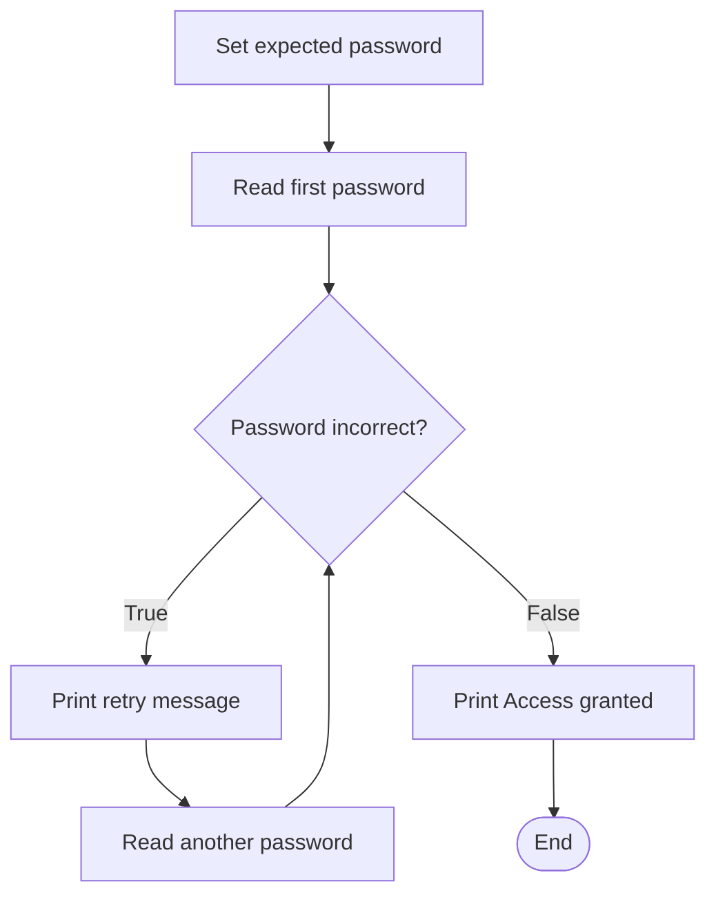
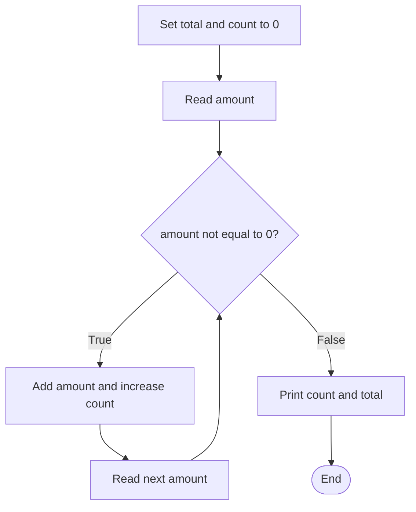

# Unit 4 (week 5): Iteration in Python

**J0HA 34 Computer Programmiung | HNC Cybersecurity**

This handout follows the practical worksheet: `for` loops, totals and counters, `while` loops, debugging, then turtle graphics. The final section supports the optional extensions; functions are not required for the core activities.

## Learning intentions

By the end of this handout, you should be able to:

- Explain how a loop repeats a block of instructions.
- Use `for` and `range()` for a known number of repetitions.
- Trace counters and running totals as a loop executes.
- Explain how a `while` condition controls repetition and how a loop stops.
- Choose a suitable loop and recognise common mistakes.

## Before you start: why use a loop?

In the selection topic, we used conditions to choose which instructions to run. This week, we use loops to repeat instructions. **Iteration** means repetition; one iteration is one execution of the loop body.

Imagine printing a message three times:

```python
print("Check complete")
print("Check complete")
print("Check complete")
```

This works, but changing the message means editing three lines. Repeating it 100 times would mean writing much more code. A loop lets us write the action once and describe how it should repeat.

```python
for check in range(3):
    print("Check complete")
```

The indented statement is the **loop body**. Python runs it three times. The colon introduces the body, and indentation shows which statements belong to it, just as it did with `if`.

A loop does not restart the whole program. It repeats only the statements in its body. Statements after the loop run when repetition finishes.

## A. `for` loops

### 1. Numbered checks — worksheet Exercise 1

A `for` loop takes values from an iterable, such as a range of numbers, one at a time. An **iterable** is something Python can obtain successive items from. For now, we will use `range()` to supply those items.

```python
for check in range(1, 4):
    print("Check number:", check)

print("All checks complete")
```

`range(1, 4)` supplies 1, 2 and 3. At the start of each iteration, Python assigns the next value to `check`, the **loop variable**. The body then prints it. After 3, there are no more values, so Python leaves the loop and prints the final message.

| Iteration | Value of `check` | Output from the body |
| --- | --- | --- |
| 1 | 1 | `Check number: 1` |
| 2 | 2 | `Check number: 2` |
| 3 | 3 | `Check number: 3` |



Follow the return arrow from the body back to the decision. That return is what makes this a loop. Python manages the next value automatically; you do not need to add 1 to `check` yourself.

### 2. Counting up and down — worksheet Exercise 2

The **stop value is excluded**. This matters when deciding how many times the body will run.

| Expression | Values supplied | Meaning |
| --- | --- | --- |
| `range(4)` | 0, 1, 2, 3 | Start at 0 and stop before 4 |
| `range(1, 4)` | 1, 2, 3 | Start at 1 and stop before 4 |
| `range(2, 9, 2)` | 2, 4, 6, 8 | Increase by 2 each time |
| `range(3, 0, -1)` | 3, 2, 1 | Decrease by 1 each time |
| `range(0)` | No values | The body does not run |

The third argument is the **step**. It defaults to 1 and cannot be zero. Use a negative step when counting down. `range(3, 0)` is empty because the default positive step cannot move from 3 towards a lower stop value.

Two loops placed one after the other run in sequence: the first finishes before the second starts. They do not need to be nested to count up and then count down.

```python
limit = int(input("Enter a positive whole number: "))

for number in range(1, limit + 1):
    print(number)

print("Counting down")

for number in range(limit, 0, -1):
    print(number)
```

This example assumes a positive whole number. `limit + 1` includes the chosen limit on the way up; the stop value 0 includes 1 on the way down. Neither loop prints 0.

`range()` expects integers. If the user supplies a repetition count, convert the input with `int()` before passing it to `range()`.

**Further reading:** [Python tutorial: `for` and `range()`](https://docs.python.org/3/tutorial/controlflow.html), [W3Schools: for loops](https://www.w3schools.com/python/python_for_loops.asp).

## B. Counting and accumulation

### 3. Add prices and count items — worksheet Exercise 3

An **accumulator** combines values as they arrive. For a running sum, start at zero and add each new value to the existing total.

```python
total = 0.0

for item in range(1, 4):
    price = float(input("Enter a price: "))
    total = total + price

print("Total:", total)
```

`input()` returns text. `float()` converts it to a number that can include a decimal part. Enter `2.50`, without a currency symbol. The new `price` replaces the previous price on each iteration, but `total` preserves the sum so far.

| Iteration | Entered price | Total before addition | Total after addition |
| --- | --- | --- | --- |
| 1 | 2.50 | 0.00 | 2.50 |
| 2 | 3.00 | 2.50 | 5.50 |
| 3 | 1.50 | 5.50 | 7.00 |



The initial assignment runs once. The update runs for each price. The final print runs after all prices have been added. Moving the initial assignment inside the loop would reset the total each time.

A **counter** records how many times something happens. It usually adds 1, while a running total adds the current value. Both keep information between iterations. `total += price` is the shorter form of `total = total + price`.

For a price display with two decimal places, use `print(f"Total: £{total:.2f}")`. The `f` allows a value inside braces, and `:.2f` displays two digits after the decimal point. This changes the display, not the stored value.

### Combining a total with a counter

For the adaptation in Exercise 3, keep two separate variables: one for the total price and one for the number of prices above £5. Initialise both before the loop. Add every price to the total, but increase the counter only when the comparison is true.

The counter update therefore belongs inside an `if`, which itself belongs inside the loop. This creates two indentation levels. A price of exactly £5 is not above £5, so it contributes to the total without increasing that counter.

### 4. Count failed logins — worksheet Exercise 4

A **counter** records how many times something happens. The loop variable tells us which item we are processing; a separate counter can tell us how many items meet a condition.

This example asks for three simulated login outcomes and counts failures. Enter `success` or `failure` exactly as shown, in lowercase with no extra spaces. This smaller example uses three outcomes; the worksheet asks you to process five.

```python
failures = 0

for attempt in range(1, 4):
    outcome = input("Login outcome (success/failure): ")
    if outcome == "failure":
        failures = failures + 1

print("Failed logins:", failures)
```

The counter starts at zero **before** the loop. On each iteration, the `if` checks the current answer. Only a failure increases the counter. Notice the two indentation levels: the `if` belongs to the loop, and the counter update belongs to the `if`.

`failures = failures + 1` means “take the current value, add 1, and store the result back in the same variable”. It is an assignment, not an algebraic equation. Python also allows the shorter form `failures += 1`.

| Input | Counter before the check | Counter after the check |
| --- | --- | --- |
| `failure` | 0 | 1 |
| `success` | 1 | 1 |
| `failure` | 1 | 2 |

The final output is `Failed logins: 2`. This example assumes valid outcome words; it does not yet reject other answers.

`input()` already returns a string, so no numeric conversion is needed. `"Failure"` and `"failure"` are different strings. You do not need `strip()` or `lower()` for this exercise.

In the worksheet, the decision to flag a batch happens **after** the loop. The check for an individual failure happens **inside** it. This means the final decision uses the complete count, rather than making a new decision after every entry.

## C. `while` loops

### 5. Keep asking for a password — worksheet Exercise 5

A `while` loop checks a condition before each iteration. If it is true, Python runs the body and returns to the check. If it is false, Python skips the body and continues after the loop. The comparison produces a Boolean just as it did with `if`, but now it controls repetition.

Use a made-up password for this classroom example. The purpose is to understand the loop; this is not a complete login system.

```python
expected_password = "python123"
password = input("Enter the password: ")

while password != expected_password:
    print("Incorrect password. Try again.")
    password = input("Enter the password: ")

print("Access granted")
```

Read the condition as “while the entered password is not equal to the expected password”. The first input gives `password` a value before the check. The second input replaces it after each incorrect answer. The loop ends when the comparison becomes false.



| Entered text | Result of `password != expected_password` | What happens next? |
| --- | --- | --- |
| `wrong` | `True` | Print retry message and ask again |
| `Python123` | `True` | Ask again: the capital letter changes the string |
| `python123` | `False` | Leave the loop and print `Access granted` |

For this sequence, there are three inputs but only two executions of the loop body. If the first input is correct, the body runs **zero times**. The initial prompt is outside the loop and still runs once.

### Counting attempts

An attempt is an entered password, not necessarily an iteration. To count every attempt, including the successful one, start the counter at 1 after the first input. Increase it whenever the loop reads another answer. Print the final count after the loop.

For example, one incorrect entry followed by a correct entry means two attempts, even though the body runs only once. Trace the attempt count rather than printing entered passwords.

### What makes the loop stop?

A `for` loop over a range obtains its next value automatically. A `while` loop does not update your variables for you. Here, the new input gives the condition a chance to become false. Without the second input, an incorrect first password would stay unchanged and the loop would keep printing its message: an **infinite loop**.

Before running a `while` loop, identify what changes and how that can make the condition false. If a program keeps running unexpectedly, use your editor's Stop button or Ctrl+C in a terminal, then check the update and indentation.

**Further reading:** [W3Schools: while loops](https://www.w3schools.com/python/python_while_loops.asp).

### 6. Keep a running total until zero — worksheet Exercise 6

Sometimes we do not know how many values the user will enter. A **sentinel** is an agreed value that means “stop”. In this example, 0 ends entry and is not counted as a reading.

```python
total = 0.0
count = 0
amount = float(input("Enter an amount, or 0 to finish: "))

while amount != 0:
    total = total + amount
    count = count + 1
    amount = float(input("Enter an amount, or 0 to finish: "))

print("Amounts entered:", count)
print("Total:", total)
```

The first input happens before the loop so that `amount` exists when Python first checks the condition. Each accepted amount is added and counted. The input at the bottom obtains a new value for the next check.



Entering 4, 6 and 0 gives a count of 2 and a total of 10. Entering 0 immediately gives a count of 0 and a total of 0. The sentinel is checked before the body, so it never increases the count.

If the second input were missing, the loop would keep processing the same non-zero amount. This is the same pattern as the password loop: the next input gives the condition a new value to check.

The sentinel must suit the task. Here, zero cannot also be recorded as an ordinary reading. If zero were meaningful data, we would need a different stopping rule.

### 7. Find the bug: initialisation and updates — worksheet Exercise 7

| Situation | Suitable starting point | Reason |
| --- | --- | --- |
| Ask for exactly five results | `for` with `range()` | The repetition count is known |
| Process each item in a sequence | `for` | Each supplied item is visited in turn |
| Keep asking until a stop value arrives | `while` | The number of entries is not known |
| Ask until the password matches | `while` | The number of attempts is not known |

Initialisation gives a variable its starting value. An update changes that value using the work done so far. If you put `total = 0.0` inside a price-entry loop, every iteration discards the previous total. After the last iteration, only the final price remains in the sum.

With prices 2, 3 and 4, a correctly placed initialisation gives running totals of 2, 5 and 9. Resetting inside the loop instead gives 2, 3 and 4. All the statements are valid Python; their position causes the logic error.

When a result is wrong, trace a small example rather than guessing. Write down the variable values before and after each update.

| Symptom | What to check |
| --- | --- |
| One repetition too few | The excluded stop value in `range()` |
| A total only reflects the last entry | Whether the total is reset inside the loop |
| A loop never stops | Whether the input or control variable changes |
| A final message repeats | Whether it is accidentally indented inside the loop |
| A comparison raises a type error | Whether numeric input was converted |

The core pattern is: initialise any stored values, repeat the required work, update what needs to change, then use the result after the loop.

## D. A different application: turtle graphics

### 8. Repeat a drawing action — worksheet Exercise 8

A loop can repeat drawing commands as well as text output. Turtle opens a drawing window and moves a cursor with a pen. This needs an environment with turtle and graphical-window support.

```python
import turtle

for side in range(4):
    turtle.forward(80)
    turtle.right(90)

turtle.done()
```

`import turtle` makes the commands available. Each iteration draws a side 80 pixels long and turns clockwise by 90 degrees. Four iterations form a square. `turtle.done()` keeps the window open until you close it; it goes after the loop.

For a regular polygon, each side is the same length and the turns are equal. The turtle turns through 360 degrees in total, so the exterior turning angle is `360 / sides`.

| Sides | Turn after each side | Result |
| --- | --- | --- |
| 3 | 120 degrees | Triangle |
| 4 | 90 degrees | Square |
| 6 | 60 degrees | Hexagon |

In the worksheet, first check that the side count is between 3 and 8. Only then calculate the angle and run the drawing loop. The loop belongs inside the valid-input branch; its movement and turn belong inside the loop. This is selection controlling whether repetition happens.

The `# PLACEHOLDER CODE HERE` line is a comment marking where to add those instructions. Python ignores comments, so the starter will not draw a polygon until you replace it with your code.

**Further reading:** [Python documentation: turtle graphics](https://docs.python.org/3/library/turtle.html).

## For the Brave (or non-beginners)

These notes follow the extension order in the worksheet. They are optional. We have not covered functions yet, so the function-based challenge comes second.

### Extension 1. Handle mistyped readings

The core activities assume numeric input can be converted. `float("hello")` cannot be converted and raises a `ValueError`. `try/except ValueError` allows a program to respond to that error and ask again. Update the count and total only after conversion succeeds.

For this extension, `q` replaces zero as the stop signal. Check for `q` before attempting numeric conversion, because it is a command rather than a number. Zero can now be recorded and counted as ordinary data.

The extension also accepts surrounding spaces and uppercase `Q`. Two string methods can help: `.strip()` returns text without leading or trailing whitespace, and `.lower()` returns a lowercase version. For example, `" Q ".strip().lower()` produces `"q"`. They do not convert text to a number; use `float()` separately for numeric entries. These methods are additional material for this extension, not a requirement for the core password exercise.

After entry finishes, calculate the mean as `total / count` only when the count is greater than zero. With no accepted readings, there is no mean and division by zero must be avoided.

**Further reading:** [W3Schools: try/except](https://www.w3schools.com/python/python_try_except.asp).

### Extension 2. Functions, assertions and unit testing

A function groups instructions into a named operation. In `summarise(readings)`, `readings` supplies the numbers to process. The loop calculates the count and total, and `return` sends the results back to the code that called the function. This lets the calculation be tested without typing answers into prompts.

An assertion checks a result automatically. After defining the function, a test such as `assert summarise([2, 4, 6]) == (3, 12, 4)` checks for a count of 3, total of 12 and mean of 4. A true comparison lets execution continue silently; a false comparison raises `AssertionError`.

This is an introduction to **unit testing**: checking a small part of a program, such as one function, with known inputs and expected outputs. Include different cases, particularly an empty list, rather than testing only one ordinary example. The worksheet explains how to write and interpret these assertions. Use normal validation for user input: assertions can be disabled when Python runs with optimisation.

**Further reading:** [W3Schools: functions](https://www.w3schools.com/python/python_functions.asp), [W3Schools: assert examples](https://www.w3schools.com/python/ref_keyword_assert.asp), [Python unittest: basic example](https://docs.python.org/3/library/unittest.html#basic-example).

## Sources and further reading

- [Python tutorial: for statements and range](https://docs.python.org/3/tutorial/controlflow.html)
- [Python reference: while statements](https://docs.python.org/3/reference/compound_stmts.html#the-while-statement)
- [Python documentation: input](https://docs.python.org/3/library/functions.html#input)
- [W3Schools: for loops](https://www.w3schools.com/python/python_for_loops.asp)
- [W3Schools: while loops](https://www.w3schools.com/python/python_while_loops.asp)
- [W3Schools: operators, including assignment operators](https://www.w3schools.com/python/python_operators.asp)
