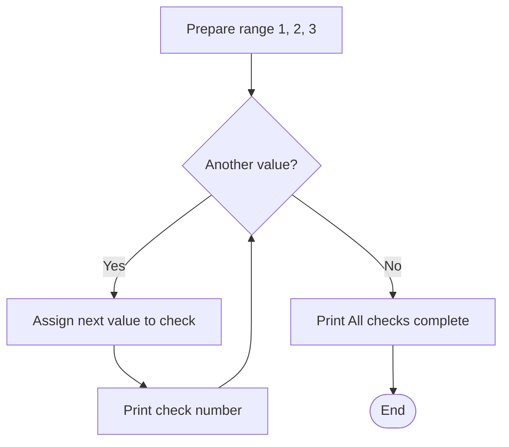
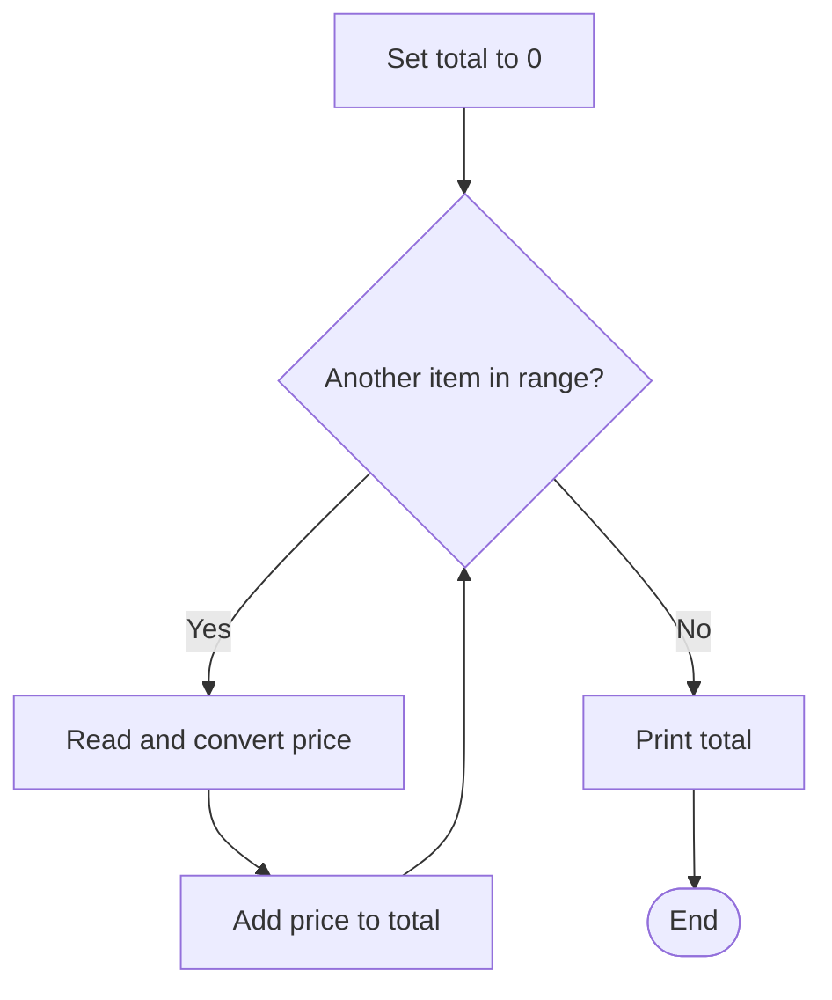
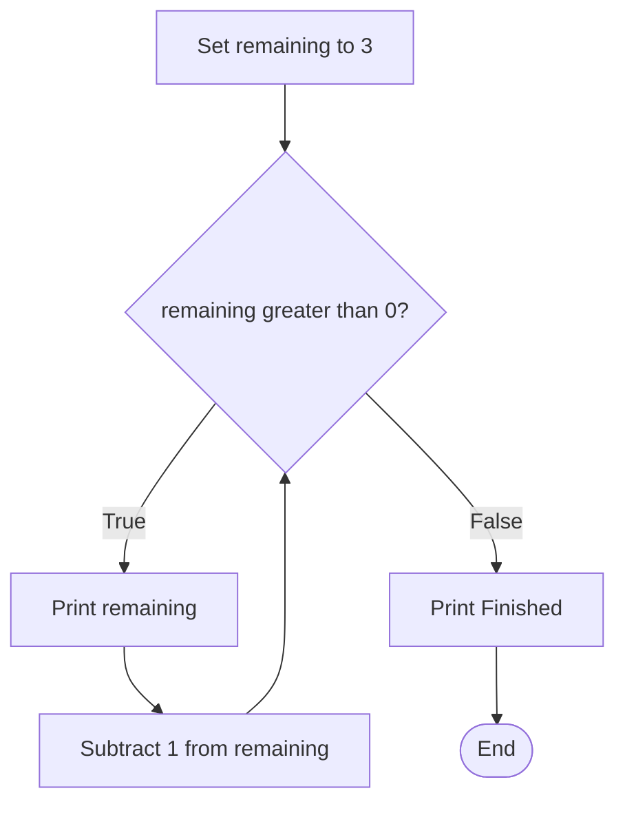
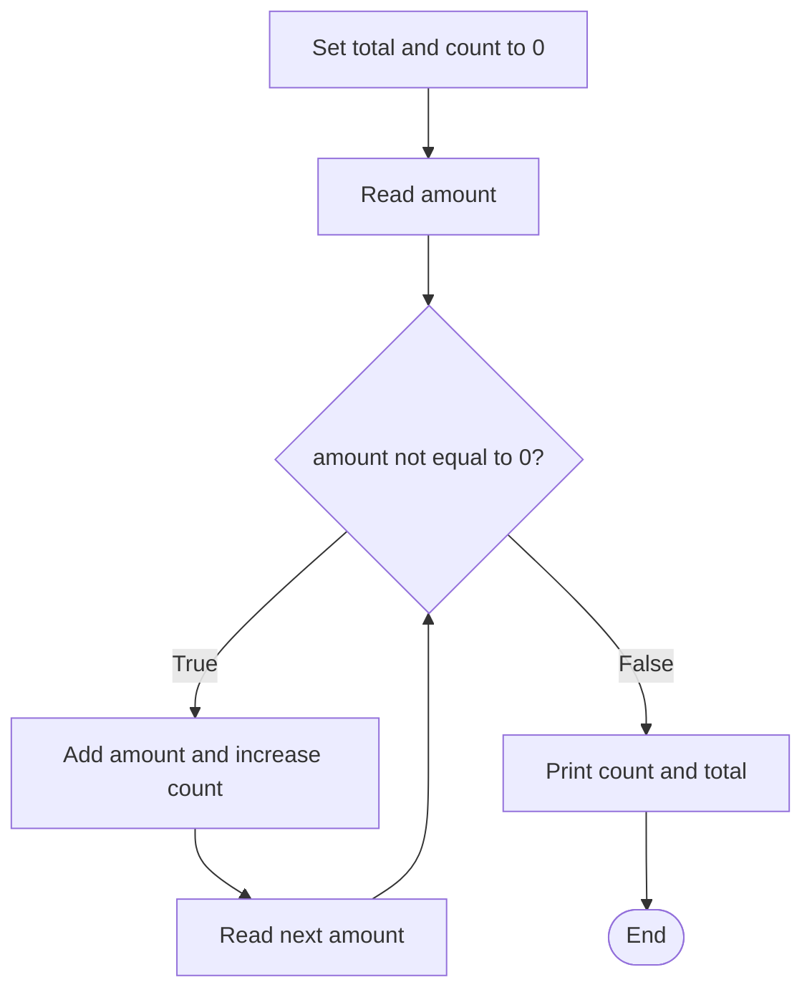

# Week 4: Iteration in Python

**J0HA 34 Computer Programming | HNC Cybersecurity**

## Learning Outcomes

By the end of this handout, you should be able to:

- Explain how a loop repeats a block of instructions.
- Use `for` and `range()` for a known number of repetitions.
- Trace counters and running totals as a loop executes.
- Explain how a `while` condition controls repetition and how a loop stops.
- Choose a suitable loop and recognise common mistakes.

## 1. Why use a loop?

Last week, we used conditions to choose which instructions to run. This week, we use loops to repeat instructions. **Iteration** means repetition; one iteration is one execution of the loop body.

Imagine printing a message three times:

```python
print("Check complete")
print("Check complete")
print("Check complete")
```

This works, but changing the message means editing three lines. Repeating it 100 times would mean writing much more code. A loop lets us write the action once and describe how it should repeat.

```python
for check in range(3):
    print("Check complete")
```

The indented statement is the **loop body**. Python runs it three times. The colon introduces the body, and indentation shows which statements belong to it, just as it did with `if`.

A loop does not restart the whole program. It repeats only the statements in its body. Statements after the loop run when repetition finishes.

## 2. `for`: work through a sequence

A `for` loop takes values from an iterable, such as a range of numbers, one at a time. An **iterable** is something Python can obtain successive items from. For now, we will use `range()` to supply those items.

```python
for check in range(1, 4):
    print("Check number:", check)

print("All checks complete")
```

`range(1, 4)` supplies 1, 2 and 3. At the start of each iteration, Python assigns the next value to `check`, the **loop variable**. The body then prints it. After 3, there are no more values, so Python leaves the loop and prints the final message.

| Iteration | Value of `check` | Output from the body |
| --- | --- | --- |
| 1 | 1 | `Check number: 1` |
| 2 | 2 | `Check number: 2` |
| 3 | 3 | `Check number: 3` |



Follow the return arrow from the body back to the decision. That return is what makes this a loop. Python manages the next value automatically; you do not need to add 1 to `check` yourself.

### Understanding `range()`

The **stop value is excluded**. This matters when deciding how many times the body will run.

| Expression | Values supplied | Meaning |
| --- | --- | --- |
| `range(4)` | 0, 1, 2, 3 | Start at 0 and stop before 4 |
| `range(1, 4)` | 1, 2, 3 | Start at 1 and stop before 4 |
| `range(2, 9, 2)` | 2, 4, 6, 8 | Increase by 2 each time |
| `range(3, 0, -1)` | 3, 2, 1 | Decrease by 1 each time |
| `range(0)` | No values | The body does not run |

The third argument is the **step**. It defaults to 1 and cannot be zero. Use a negative step when counting down. `range(3, 0)` is empty because the default positive step cannot move from 3 towards a lower stop value.

`range()` expects integers. If the user supplies a repetition count, convert the input with `int()` before passing it to `range()`.

**Further reading:** [Python tutorial: `for` and `range()`](https://docs.python.org/3/tutorial/controlflow.html), [W3Schools: for loops](https://www.w3schools.com/python/python_for_loops.asp).

## 3. Counting: how many meet a condition?

A **counter** records how many times something happens. The loop variable tells us which item we are processing; a separate counter can tell us how many items meet a condition.

This example asks for three simulated login outcomes and counts failures. Enter `success` or `failure` at each prompt.

```python
failures = 0

for attempt in range(1, 4):
    outcome = input("Login outcome (success/failure): ").strip().lower()
    if outcome == "failure":
        failures = failures + 1

print("Failed logins:", failures)
```

The counter starts at zero **before** the loop. On each iteration, the `if` checks the current answer. Only a failure increases the counter. Notice the two indentation levels: the `if` belongs to the loop, and the counter update belongs to the `if`.

`failures = failures + 1` means “take the current value, add 1, and store the result back in the same variable”. It is an assignment, not an algebraic equation. Python also allows the shorter form `failures += 1`.

| Input | Counter before the check | Counter after the check |
| --- | --- | --- |
| `failure` | 0 | 1 |
| `success` | 1 | 1 |
| `failure` | 1 | 2 |

The final output is `Failed logins: 2`. This example assumes valid outcome words; it does not yet reject other answers.

## 4. Accumulation: keep a running total

An **accumulator** combines values as they arrive. For a running sum, start at zero and add each new value to the existing total.

```python
total = 0.0

for item in range(1, 4):
    price = float(input("Enter a price: "))
    total = total + price

print("Total:", total)
```

`input()` returns text. `float()` converts it to a number that can include a decimal part. Enter `2.50`, without a currency symbol. The new `price` replaces the previous price on each iteration, but `total` preserves the sum so far.

| Iteration | Entered price | Total before addition | Total after addition |
| --- | --- | --- | --- |
| 1 | 2.50 | 0.00 | 2.50 |
| 2 | 3.00 | 2.50 | 5.50 |
| 3 | 1.50 | 5.50 | 7.00 |



The initial assignment runs once. The update runs for each price. The final print runs after all prices have been added. Moving the initial assignment inside the loop would reset the total each time.

A counter usually adds 1; a running total adds the current value. Both keep information between iterations. `total += price` is the shorter form of `total = total + price`.

For a price display with two decimal places, use `print(f"Total: £{total:.2f}")`. The `f` allows a value inside braces, and `:.2f` displays two digits after the decimal point. This changes the display, not the stored value.

## 5. `while`: repeat while a condition is true

A `while` loop checks a condition before each iteration. If it is true, Python runs the body and returns to the check. If it is false, Python skips the body and continues after the loop.

This builds directly on Week 3: comparisons still produce Boolean results, but now the result decides whether to repeat.

```python
remaining = 3

while remaining > 0:
    print("Remaining:", remaining)
    remaining = remaining - 1

print("Finished")
```



| Value at the check | Is `remaining > 0` true? | What happens? |
| --- | --- | --- |
| 3 | `True` | Print 3, then change it to 2 |
| 2 | `True` | Print 2, then change it to 1 |
| 1 | `True` | Print 1, then change it to 0 |
| 0 | `False` | Leave the loop and print `Finished` |

There are three iterations but four condition checks. The last check decides to stop. If `remaining` started at 0, the body would run zero times and only `Finished` would appear.

### What makes it stop?

Unlike a `for` loop over a range, a `while` loop does not automatically update your variable. In this example, subtracting 1 eventually makes the condition false. Without that update, `remaining` stays at 3 and the loop keeps printing: an **infinite loop**.

Before running a `while` loop, identify what changes and how that change can make the condition false. If a program keeps running unexpectedly, use your editor's Stop button or interrupt it with Ctrl+C in a terminal, then check the update and indentation.

**Further reading:** [W3Schools: while loops](https://www.w3schools.com/python/python_while_loops.asp), [Python reference: the while statement](https://docs.python.org/3/reference/compound_stmts.html#the-while-statement).

## 6. Keep asking until the user chooses to stop

Sometimes we do not know how many values the user will enter. A **sentinel** is an agreed value that means “stop”. In this example, 0 ends entry and is not counted as a reading.

```python
total = 0.0
count = 0
amount = float(input("Enter an amount, or 0 to finish: "))

while amount != 0:
    total = total + amount
    count = count + 1
    amount = float(input("Enter an amount, or 0 to finish: "))

print("Amounts entered:", count)
print("Total:", total)
```

The first input happens before the loop so that `amount` exists when Python first checks the condition. Each accepted amount is added and counted. The input at the bottom obtains a new value for the next check.



Entering 4, 6 and 0 gives a count of 2 and a total of 10. Entering 0 immediately gives a count of 0 and a total of 0. The sentinel is checked before the body, so it never increases the count.

If the second input were missing, the loop would keep processing the same non-zero amount. Updating the input matters just as much as updating a countdown variable.

The sentinel must suit the task. Here, zero cannot also be recorded as an ordinary reading. If zero were meaningful data, we would need a different stopping rule.

## 7. Choosing and checking a loop

| Situation | Suitable starting point | Reason |
| --- | --- | --- |
| Ask for exactly five results | `for` with `range()` | The repetition count is known |
| Process each item in a sequence | `for` | Each supplied item is visited in turn |
| Keep asking until a stop value arrives | `while` | The number of entries is not known |
| Count down from 3 | Either | Useful for comparing how the two loops work |

When a result is wrong, trace a small example rather than guessing. Write down the variable values before and after each update.

| Symptom | What to check |
| --- | --- |
| One repetition too few | The excluded stop value in `range()` |
| A total only reflects the last entry | Whether the total is reset inside the loop |
| A loop never stops | Whether the input or control variable changes |
| A final message repeats | Whether it is accidentally indented inside the loop |
| A comparison raises a type error | Whether numeric input was converted |

The core pattern is: initialise any stored values, repeat the required work, update what needs to change, then use the result after the loop.

## Sources and further reading

- [Python tutorial: for statements and range](https://docs.python.org/3/tutorial/controlflow.html)
- [Python reference: while statements](https://docs.python.org/3/reference/compound_stmts.html#the-while-statement)
- [Python documentation: input](https://docs.python.org/3/library/functions.html#input)
- [W3Schools: for loops](https://www.w3schools.com/python/python_for_loops.asp)
- [W3Schools: while loops](https://www.w3schools.com/python/python_while_loops.asp)
- [W3Schools: operators, including assignment operators](https://www.w3schools.com/python/python_operators.asp)
