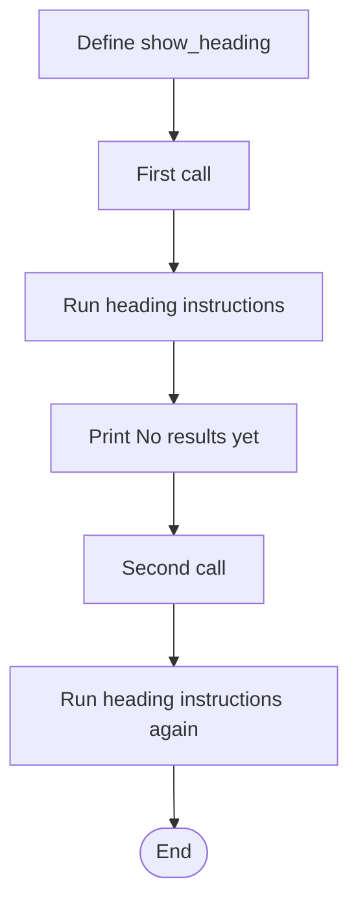
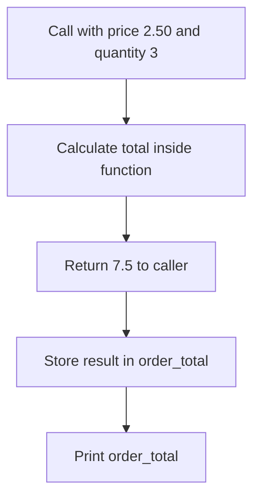

# Unit 5 (week 6): Introduction to functions

**J0HA 34  | Computer Programming**

## Learning intentions

By the end, you should be able to:

- Define and call a simple function.
- Explain the difference between a parameter and an argument.
- Distinguish displaying a value with `print()` from returning it with `return`.
- Use local variables and returned values without relying on global variables.
- Break a small program into reusable functions and check their results.

## Before you start: why functions?

A **function** is a named block of code that you can call when needed. You already use functions such as `print()`, `input()` and `int()`; now you can define your own. Give each function one clear job and a name that describes it.

## A. Define and call a function

```python
def show_heading():
    print("Login report")
    print("------------")

show_heading()
print("No results yet")
show_heading()
```

`def` introduces a function definition. `show_heading` is its name; the empty parentheses mean it has no parameters. The colon introduces the indented body.

**Defining a function does not run its body.** Calling `show_heading()` runs the indented instructions, then execution continues after the call. A second call runs them again.



Put definitions above their calls. The parentheses matter: `show_heading` alone does not run the function. Indent the body by four spaces.

## B. Pass values into a function

A **parameter** (sometimes known as *formal parameter*) is a name in a function definition that receives a value. An **argument** is the value supplied when you call the function.

```python
def greet_user(username):
    print("Hello", username)

name = input("Enter your name: ")
greet_user(name)
greet_user("Sam")
```

`username` is the parameter; the arguments are the value in `name` and the string `"Sam"`. **The names do not have to match**: the function receives the caller’s value under its own parameter name.

```python
def show_result(username, failures):
    print("Account:", username)
    print("Failed logins:", failures)

show_result("Sam", 2)
```

Arguments are matched by position: `"Sam"` goes into `username`, and `2` into `failures`. Supply the required arguments in the correct order.

`input()` returns text. Convert numeric input before passing it in, for example `failures = int(input("Number of failures: "))`. Calling a function does not automatically convert its arguments.

**Help:** [W3Schools: Python functions](https://www.w3schools.com/python/python_functions.asp).

## C. Return a result

`return` sends a result back to the caller and ends the current function call.

```python
def calculate_total(price, quantity):
    total = price * quantity
    return total

order_total = calculate_total(2.50, 3)
print("Order total:", order_total)
```

The returned value, 7.5, is stored in `order_total` for the caller to display or use.



| Expression | What it does |
| --- | --- |
| `print(total)` | Displays a value for the person running the program |
| `return total` | Gives a value back to the calling code and ends this call |
| `order_total = calculate_total(2.50, 3)` | Calls the function and stores its returned value |

A function that finishes without an explicit return value returns `None`. `print()` also returns `None`: displaying a number does not send that number back to the caller. Trying to use `None` in arithmetic causes a `TypeError`.

### Local variables

`total`, `price` and `quantity` are **local** to the function call. Outside code cannot access those local names directly; it receives the result through `return`. Each call has its own local variables.

Use parameters to pass values in and `return` to pass a result out. There is no need for `global` in these examples.

## D. Combine functions with selection and iteration

### Return a Boolean decision

A function can return any suitable value, including `True` or `False`. That result can be used directly in an `if` statement.

```python
def needs_review(failures):
    return failures >= 3

failure_count = int(input("Number of failed logins: "))

if needs_review(failure_count):
    print("Review this batch")
else:
    print("No review flag")
```

The function returns the comparison’s Boolean result; the caller chooses the message. This example uses a classroom rule for simulated login data.

| Argument | Returned value |
| --- | --- |
| 0 | `False` |
| 2 | `False` |
| 3 | `True` |
| 4 | `True` |

The boundary test of 3 matters: `>= 3` includes exactly three failures, while `> 3` does not.

### Put a loop inside a function

```python
def total_to(limit):
    total = 0
    for number in range(1, limit + 1):
        total = total + number
    return total

print(total_to(3))
print(total_to(0))
```

This prints 6, then 0. Each call starts a fresh total. A limit of 3 adds 1, 2 and 3; a limit of 0 gives an empty range and returns the initial zero.

**`return` ends the current function call.** Here, it belongs after the loop. Indenting it inside the loop would end the call on its first iteration, before the sum is complete.

## E. Functions that perform an action

A function can perform an action, such as printing or drawing, rather than return a calculated result. For example, `draw_square(size)` could reuse the same loop to draw squares of different sizes.

Printing and drawing are **side effects**: observable actions beyond returning a value. Such a function can be useful even when it returns `None`.

## For the Brave (or non-beginners)

A validation function can ask repeatedly until it can return a valid value. A separate calculation function can then work with that value, without handling input itself.

An **assertion** checks an expected result automatically. For example, `assert total_to(3) == 6` continues silently if correct or raises `AssertionError` if not. This is a first step towards **unit testing**: checking one function with known inputs and expected results. Include boundaries and empty cases. Use ordinary conditions and exception handling for user-input validation; assertions can be disabled when Python runs with optimisation.

## Quick reference

| Term | Meaning |
| --- | --- |
| Definition | Code beginning with `def` that creates a function |
| Call | An instruction to run the function, using parentheses |
| Parameter | A name in the definition that receives data |
| Argument | A value supplied in a call |
| Return value | The result sent back to the caller |
| Local variable | A name belonging to a particular function call |

## Sources and further reading

- [Python tutorial: defining functions](https://docs.python.org/3/tutorial/controlflow.html#defining-functions)
- [W3Schools: functions](https://www.w3schools.com/python/python_functions.asp)
- [W3Schools: variable scope](https://www.w3schools.com/python/python_scope.asp)
- [W3Schools: assertions with examples](https://www.w3schools.com/python/ref_keyword_assert.asp)
- [Python documentation: turtle graphics](https://docs.python.org/3/library/turtle.html)
