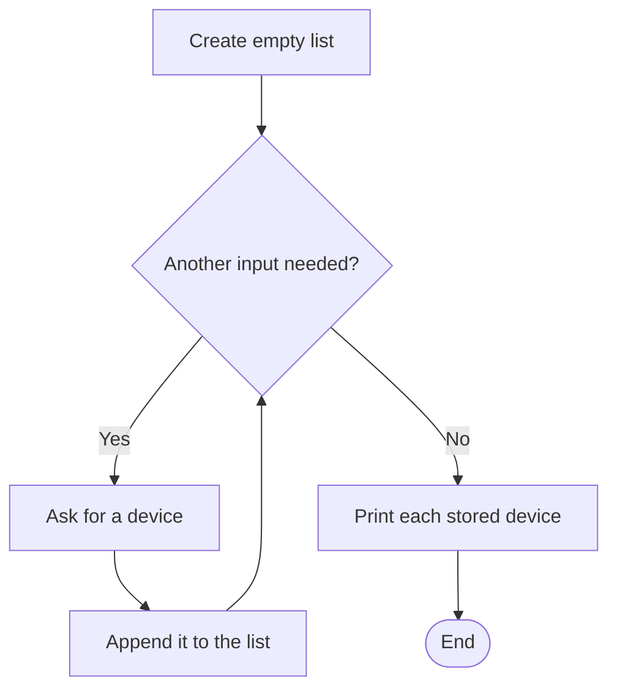
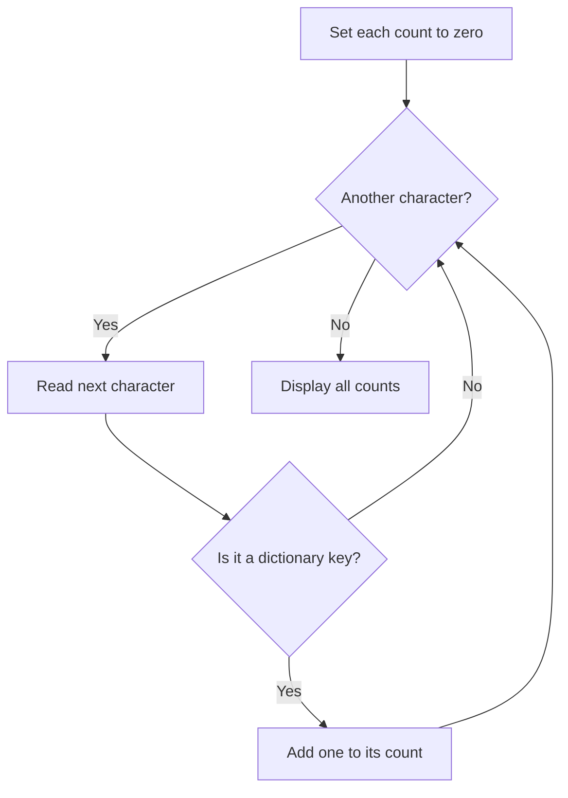

# Lists, strings and dictionaries

**J0HA34 Computer Programming | HNC Cybersecurity**

## Learning intentions

By the end, you should be able to:

- Store several values in a list and access them by index.
- Use a loop to work through a list or string.
- Change the case of text, count its characters and build new strings.
- Store and update named counts in a dictionary.

## A. Lists: several values, one variable

A **list** holds a sequence of items. Use square brackets around the items and commas between them. Here, each item is a string:

```python
days = ["Sunday", "Monday", "Tuesday", "Wednesday", "Thursday", "Friday", "Saturday"]
print(days[2])  # Tuesday
```

An **index** is an item's position. Python counts positions from zero, so index `2` selects the third item.

| Index | 0 | 1 | 2 | 3 | 4 | 5 | 6 |
| --- | --- | --- | --- | --- | --- | --- | --- |
| Item | Sunday | Monday | Tuesday | Wednesday | Thursday | Friday | Saturday |

`days[-1]` selects the last item. `len(days)` gives the number of items: 7. There is no item at index 7; trying to read it raises an `IndexError`.

Lists can change after they are created. You can replace an item by index or add an item with `.append()`:

```python
devices = ["Laptop", "Tablet"]
devices[1] = "Desktop"
devices.append("Phone")
print(devices)  # ['Laptop', 'Desktop', 'Phone']
```

`.append()` changes the existing list. Use it as shown; do not assign its result back to `devices`.

## B. Loops: work through the items

A `for` loop can take each item directly from a list. You do not need to calculate an index when you simply want every item.

```python
devices = ["Laptop", "Desktop", "Phone"]
for device in devices:
    print(device)
```

On each repetition, `device` receives the next item. The indented statement runs once for each item, in order. An empty list, written `[]`, gives the loop no items to process.

You can also start with an empty list and collect user input:

```python
devices = []
for number in range(2):
    device = input("Enter a device: ")
    devices.append(device)

print("You entered:")
for device in devices:
    print(device)
```

The first loop runs twice and adds two strings. The second reads the completed list and displays each item. Keep the list creation before the loop so it is not reset on every repetition.



Further reading: [Python tutorial: lists](https://docs.python.org/3/tutorial/introduction.html#lists) and [list methods](https://docs.python.org/3/tutorial/datastructures.html#more-on-lists).

## C. Strings: working with text

A **string** is a sequence of characters. Like a list, it supports indexing, `len()` and a `for` loop. A string's items are its individual characters.

```python
word = "Python"
print(word[0])   # P
print(word[-1])  # n
print(len(word)) # 6

for character in word:
    print(character)
```

`len()` counts characters, including spaces and punctuation. For a simple name such as `Sam`, that is also the number of letters. For `Anne-Marie`, the hyphen counts too.

### Changing case

A **method** is an operation called on a value using a dot and parentheses. String methods such as `.upper()` and `.lower()` return new strings:

```python
name = "Alex"
shouting = name.upper()
print(shouting)  # ALEX
print(name)      # Alex

name = name.lower()
print(name)      # alex
```

The original string is not changed in place. Store or print the returned string to use it. Strings are **immutable**: you cannot replace an individual character with an assignment such as `name[0] = "a"`.

[W3Schools: string methods](https://www.w3schools.com/python/python_strings_methods.asp) lists these operations with examples.

### Joining text and checking for empty input

`+` joins strings together. This is called **concatenation**.

```python
prefix = "student"
number = "12"
username = prefix + number
print(username)  # student12
```

Here, `number` is already a string. To join an integer to text with `+`, convert it with `str()` first.

An empty string has no first or last character. Check before indexing user input:

```python
name = input("Enter your first name: ")
if name != "":
    print(name[0])
else:
    print("Please enter a name")
```

Pressing Enter without typing gives `""`. A space is still a character; `.strip()` returns a string with surrounding whitespace removed if you need to treat spaces-only input as empty.

Further reading: [Python tutorial: text](https://docs.python.org/3/tutorial/introduction.html#text).

## D. Dictionaries: look up a value by name

A **dictionary** stores pairs of keys and values. A key identifies the value you want. Use braces for the dictionary and a colon between each key and its value:

```python
attempts = {"sam": 0, "alex": 2}
print(attempts["alex"])  # 2
attempts["sam"] = attempts["sam"] + 1
print(attempts["sam"])   # 1
```

`"sam"` is a key and `0` is its initial value. The assignment reads that value, adds one and stores the updated count under the same key. Each key is unique.

A dictionary lookup uses a key, not a list position. Reading a missing key raises a `KeyError`. Check membership with `in` when you do not know whether a key exists:

```python
attempts = {"sam": 0, "alex": 2}
username = input("Account name: ")
if username in attempts:
    print("Recorded attempts:", attempts[username])
else:
    print("Account not found")
```

For a dictionary, `in` checks its keys. Looping over a dictionary also gives you its keys:

```python
attempts = {"sam": 0, "alex": 2}
for username in attempts:
    print(username, attempts[username])
```

See [Python tutorial: dictionaries](https://docs.python.org/3/tutorial/datastructures.html#dictionaries) and [W3Schools: dictionaries](https://www.w3schools.com/python/python_dictionaries.asp).

## E. Combining a loop, a condition and a count

To count selected characters, start each count at zero. Work through the text, decide whether each character is one you are tracking, then update only the matching count.

```python
symbols = {"!": 0, "?": 0}
message = "Hello! Ready? Really?"

for character in message:
    if character in symbols:
        symbols[character] = symbols[character] + 1

for symbol in symbols:
    print(symbol, symbols[symbol])
```

This displays 1 for `!` and 2 for `?`. Other characters are ignored. Keep the dictionary creation outside the loop so earlier counts are retained.



## Quick reference

| Expression | Meaning |
| --- | --- |
| `items[0]` | First list item |
| `text[-1]` | Last character of a non-empty string |
| `len(value)` | Number of items or characters |
| `items.append(value)` | Add an item to the end of a list |
| `text.lower()` | Return a lowercase version |
| `text.upper()` | Return an uppercase version |
| `text.strip()` | Return text without surrounding whitespace |
| `key in counts` | Check whether a dictionary contains a key |
| `counts[key]` | Read the value stored under that key |
